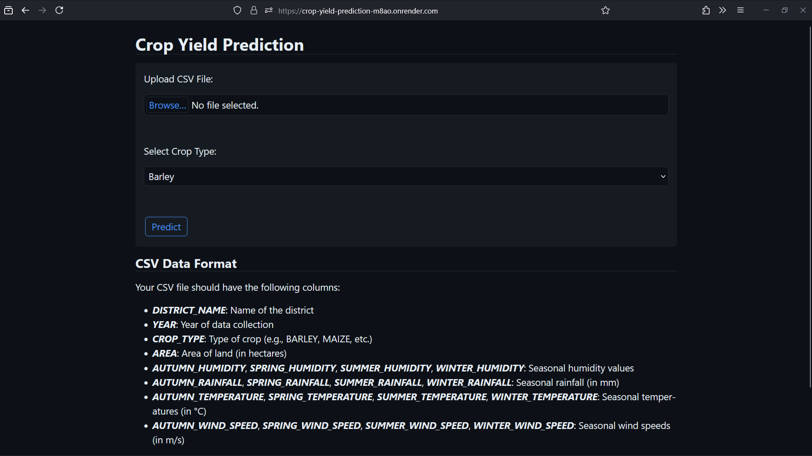

<!-- write a readme.md for my github repo of this project -->
# Crop Yield Prediction

This repository contains code and data for predicting crop yields using various machine learning models. The project includes data preprocessing, model training, hyperparameter tuning, and model evaluation.

## Getting Started

### Prerequisites

- Python 3.x
- Required Python packages (listed in `requirements.txt`)

### Installation

1. Clone the repository:
    ```sh
    git clone https://github.com/yourusername/cropYieldPrediction.git
    cd cropYieldPrediction
    ```

2. Create a virtual environment and activate it:
    ```sh
    python -m venv environment
    source environment/bin/activate  # On Windows use `environment\Scripts\activate`
    ```

3. Install the required packages:
    ```sh
    pip install -r requirements.txt
    ```

### Usage

1. **Data Preprocessing**:
    - Run the `splitData.py` script to preprocess the data and split it by crop type:
        ```sh
        python other\ scripts/splitData.py
        ```

2. **Model Training**:
    - Train and export Random Forest models for each crop using `exportingModels.py`:
        ```sh
        python exportingModels.py
        ```

3. **Hyperparameter Tuning**:
    - Use `choosingHyperParametersForSVR.py` to tune hyperparameters for the SVR model:
        ```sh
        python other\ scripts/choosingHyperParametersForSVR.py
        ```

4. **K-Fold Cross-Validation**:
    - Perform k-fold cross-validation using `k-fold.py`:
        ```sh
        python k-fold.py
        ```

### Notebooks

- `completeAlgorithms.ipynb`: Contains the complete workflow for data preprocessing, model training, and evaluation.
- `modelTraining.ipynb`: Contains code for training different models and evaluating their performance.

## Results

The trained models are saved in the `models` directory. Each model is named according to the crop it was trained on (e.g., `BARLEY_rf_model.pkl`).

## WebApp of the model
if you simpy wish to get the final prediction, you can use the webApp at https://crop-yield-prediction-m8ao.onrender.com/ 

